# Golden set — the answer key, for review (LP-235)

25 fixtures, 175 field rows, **with the label images inline** so this can be reviewed by
looking rather than by opening files.

Every expected verdict here was written by me and is checked only against itself: the
eval asserts the engine agrees with this file, and nothing asserts this file is right.
That is the gap you are closing — the one thing between *the eval passes* and *the eval
is correct*.

## How to review

Look at the image. Compare it to the application values beside it. Ask one question per
row: **is this the verdict a TTB agent would give?**

Rows marked `clean` are the default — match, or *not applicable* where the field genuinely
does not apply (country of origin on a domestic product, alcohol content on a table wine).

**The bold rows are the deliberate defects.** Those are the ones worth your attention. If
one of them is wrong, the eval has been passing for the wrong reason all week.

Tick the box when a fixture looks right. Anything you disagree with, note it and I'll fix
the fixture — not the code.

---

### [ ] `tc01_old_tom_clean` · spirits

> TC-01 clean match. The brief's sample label, fully compliant.

| Field | Application says | Expected |
|---|---|---|
| brand_name | OLD TOM DISTILLERY | clean |
| class_type | Kentucky Straight Bourbon Whiskey | clean |
| alcohol_content | 45.0 | clean |
| net_contents | 750 mL | clean |
| producer | Old Tom Distillery | clean |
| country_of_origin | — | clean |
| government_warning | *(the statute's text)* | clean |

---

### [ ] `tc02_stones_throw` · spirits

> TC-02. Label carries a curly apostrophe and all caps; the application says 'Stone's Throw'. Dave's case — obviously the same thing, and the agent must see the judgment call rather than a silent pass.

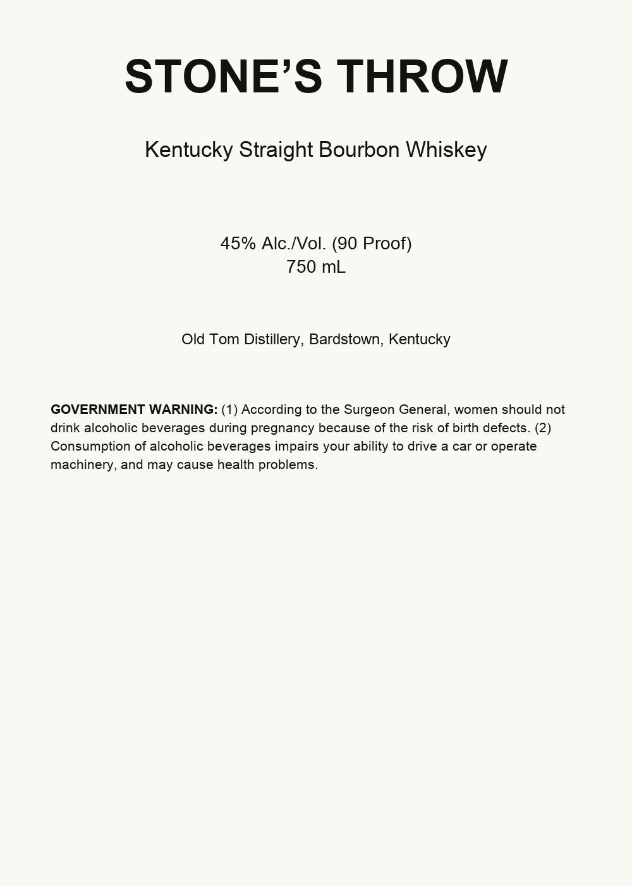

| Field | Application says | Expected |
|---|---|---|
| brand_name | Stone's Throw | **acceptable_variation** |
| class_type | Kentucky Straight Bourbon Whiskey | clean |
| alcohol_content | 45.0 | clean |
| net_contents | 750 mL | clean |
| producer | Old Tom Distillery | clean |
| country_of_origin | — | clean |
| government_warning | *(the statute's text)* | clean |

---

### [ ] `tc03_title_case_warning` · spirits

> TC-03. Jenny's catch — she rejected a real label for exactly this. The header reads 'Government Warning:' instead of all caps.

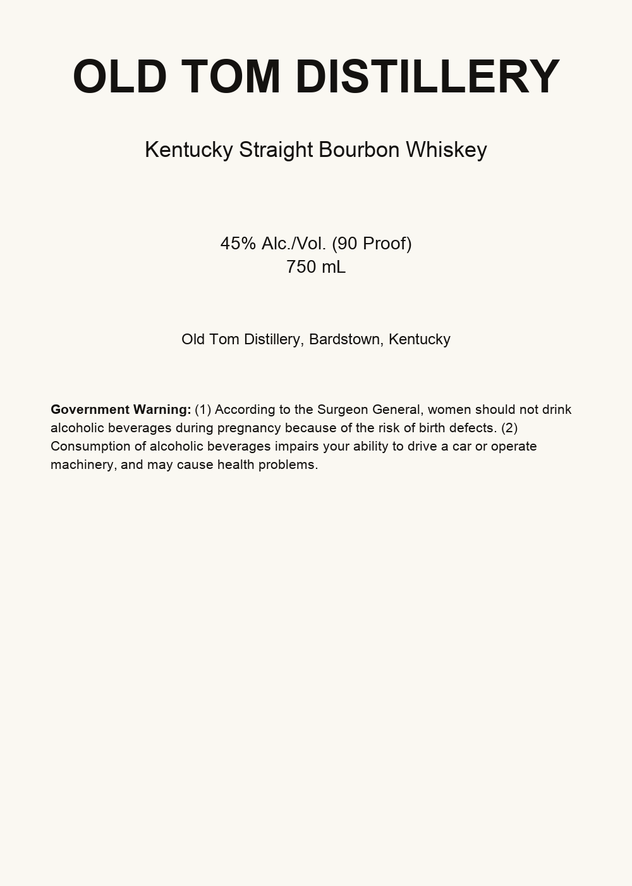

| Field | Application says | Expected |
|---|---|---|
| brand_name | OLD TOM DISTILLERY | clean |
| class_type | Kentucky Straight Bourbon Whiskey | clean |
| alcohol_content | 45.0 | clean |
| net_contents | 750 mL | clean |
| producer | Old Tom Distillery | clean |
| country_of_origin | — | clean |
| government_warning | *(the statute's text)* | **mismatch** |

---

### [ ] `tc04_bold_warning_body` · spirits

> TC-04. 16.22's inverse rule: only 'GOVERNMENT WARNING' may be bold, the remainder must not be. The one almost everyone misses.

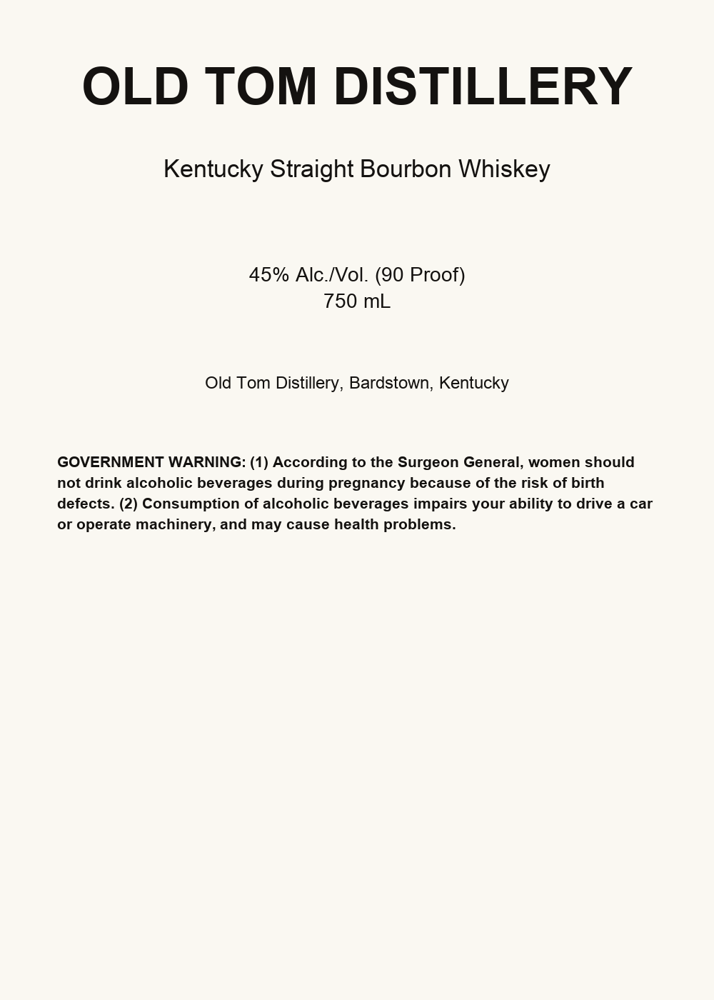

| Field | Application says | Expected |
|---|---|---|
| brand_name | OLD TOM DISTILLERY | clean |
| class_type | Kentucky Straight Bourbon Whiskey | clean |
| alcohol_content | 45.0 | clean |
| net_contents | 750 mL | clean |
| producer | Old Tom Distillery | clean |
| country_of_origin | — | clean |
| government_warning | *(the statute's text)* | **mismatch** |

---

### [ ] `tc05_reworded_warning` · spirits

> TC-05. Paraphrased clause (1). Must produce a word-level diff as evidence.

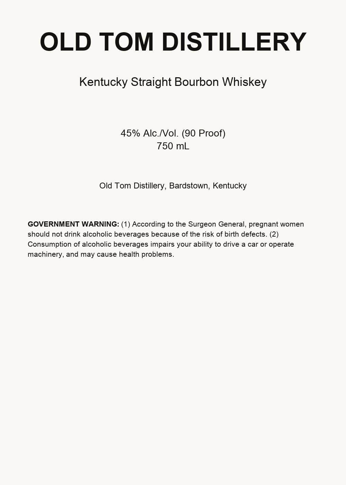

| Field | Application says | Expected |
|---|---|---|
| brand_name | OLD TOM DISTILLERY | clean |
| class_type | Kentucky Straight Bourbon Whiskey | clean |
| alcohol_content | 45.0 | clean |
| net_contents | 750 mL | clean |
| producer | Old Tom Distillery | clean |
| country_of_origin | — | clean |
| government_warning | *(the statute's text)* | **mismatch** |

---

### [ ] `tc06_buried_warning` · spirits

> TC-06. Warning present and verbatim but shrunk and low-contrast — the 'creative' evasion Jenny described. The wording is right, so this is not a correction to send back; the PRD's TC-06 row asks for Needs review with the region shown, and Unreadable is the only verdict that drives that without claiming the label is wrong (LP-211, LP-212). KNOWN TAXONOMY GAP: the PRD defines Unreadable as 'image quality prevents verification', and here the warning is read perfectly — `extracted` carries the full statement. The aggregate now matches the PRD and the field verdict does not. The six-value taxonomy has no verdict for 'read fine, complies as far as we can tell, needs a human anyway'; adding a seventh is a product decision (MATCH-1). Recorded rather than resolved. LP-211 may move this expectation from `mismatch` to `unreadable`; it cannot make it disappear, because this fixture is named in MUST_DECLARE_WARNING_VIOLATION and emptying its `expect` fails the run.

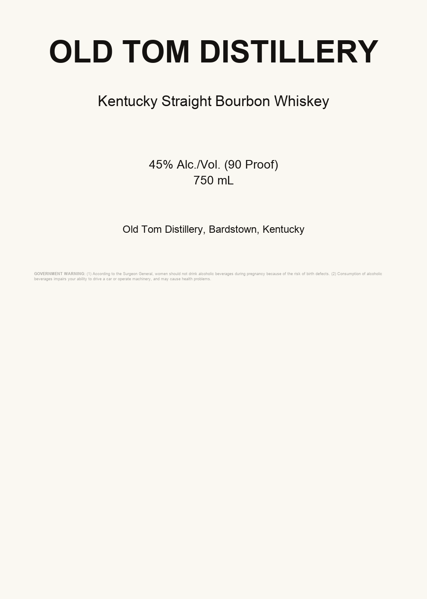

| Field | Application says | Expected |
|---|---|---|
| brand_name | OLD TOM DISTILLERY | clean |
| class_type | Kentucky Straight Bourbon Whiskey | clean |
| alcohol_content | 45.0 | clean |
| net_contents | 750 mL | clean |
| producer | Old Tom Distillery | clean |
| country_of_origin | — | clean |
| government_warning | *(the statute's text)* | **unreadable** |

Must also raise: `warning_less_prominent`, `warning_low_contrast`

---

### [ ] `tc03b_non_bold_warning_header` · spirits

> WARN-2's other half. TC-03 covers capitals; nothing covered bold, so a checker that ignored the bold signal entirely would have passed the whole fixture set. Capitals are correct here and only the weight is wrong.

| Field | Application says | Expected |
|---|---|---|
| brand_name | OLD TOM DISTILLERY | clean |
| class_type | Kentucky Straight Bourbon Whiskey | clean |
| alcohol_content | 45.0 | clean |
| net_contents | 750 mL | clean |
| producer | Old Tom Distillery | clean |
| country_of_origin | — | clean |
| government_warning | *(the statute's text)* | **mismatch** |

Must also raise: `warning_header_not_bold`

---

### [ ] `tc06b_warning_contrast_unread` · spirits

> A compliant label the extractor could not fully judge. The artwork is clean — verbatim wording, correct capitals, correct weight — and the reading comes back unable to say whether the statement contrasts with its background. That combination used to reach Ready to approve, and no fixture could produce it because the fake derived every signal from the spec and therefore always answered.

| Field | Application says | Expected |
|---|---|---|
| brand_name | OLD TOM DISTILLERY | clean |
| class_type | Kentucky Straight Bourbon Whiskey | clean |
| alcohol_content | 45.0 | clean |
| net_contents | 750 mL | clean |
| producer | Old Tom Distillery | clean |
| country_of_origin | — | clean |
| government_warning | *(the statute's text)* | **unreadable** |

Must also raise: `warning_contrast_unverified`

---

### [ ] `tc03c_warning_bold_unread` · spirits

> The abstention the whole tri-state design was built for, finally reachable from a fixture. Bold is the signal the weakest model is likeliest to decline on, and the golden set could not express a decline until now.

| Field | Application says | Expected |
|---|---|---|
| brand_name | OLD TOM DISTILLERY | clean |
| class_type | Kentucky Straight Bourbon Whiskey | clean |
| alcohol_content | 45.0 | clean |
| net_contents | 750 mL | clean |
| producer | Old Tom Distillery | clean |
| country_of_origin | — | clean |
| government_warning | *(the statute's text)* | **unreadable** |

Must also raise: `warning_header_bold_unverified`, `warning_body_bold_unverified`

---

### [ ] `tc05b_truncated_warning` · spirits

> LP-210. The commonest partial warning in the wild: clause (1) printed and clause (2) dropped, usually because the artwork ran out of room. Distinct from TC-05, which rewords rather than truncates, and the correction the applicant has to make is a different one.

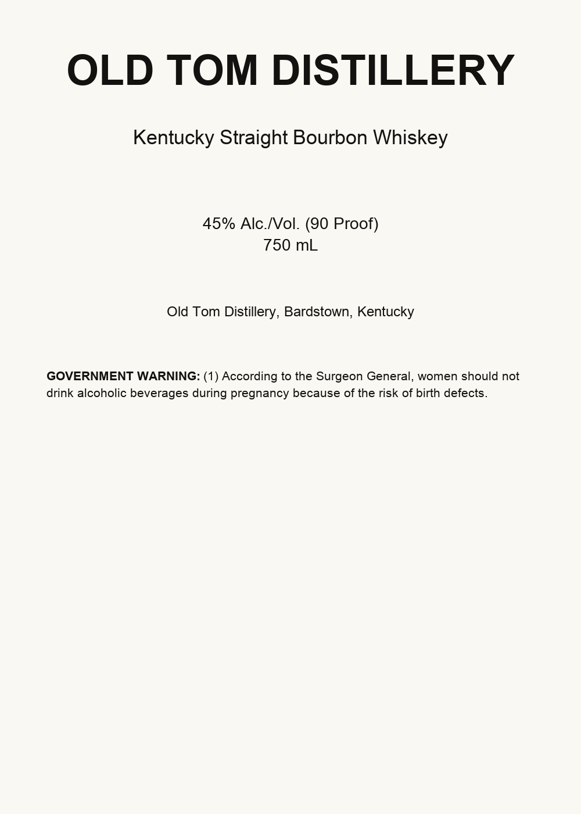

| Field | Application says | Expected |
|---|---|---|
| brand_name | OLD TOM DISTILLERY | clean |
| class_type | Kentucky Straight Bourbon Whiskey | clean |
| alcohol_content | 45.0 | clean |
| net_contents | 750 mL | clean |
| producer | Old Tom Distillery | clean |
| country_of_origin | — | clean |
| government_warning | *(the statute's text)* | **mismatch** |

Must also raise: `warning_text_truncated`

---

### [ ] `tc07_missing_warning` · spirits

> TC-07. No warning anywhere. Disqualifying on its own, ranked first.

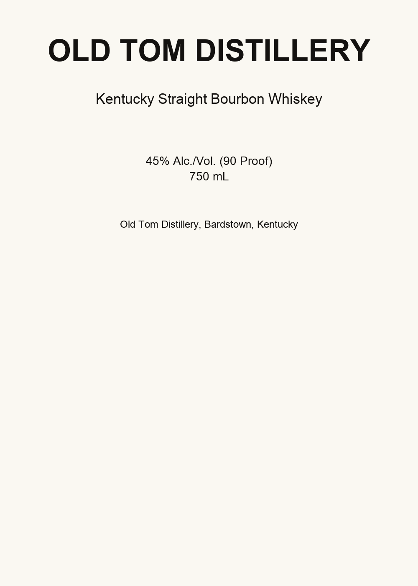

| Field | Application says | Expected |
|---|---|---|
| brand_name | OLD TOM DISTILLERY | clean |
| class_type | Kentucky Straight Bourbon Whiskey | clean |
| alcohol_content | 45.0 | clean |
| net_contents | 750 mL | clean |
| producer | Old Tom Distillery | clean |
| country_of_origin | — | clean |
| government_warning | *(the statute's text)* | **missing** |

---

### [ ] `tc08_abv_mismatch` · spirits

> TC-08. Label says 40%, application says 45%. Internally consistent — 80 proof is correct for 40% — so this isolates the comparison from TC-09.

| Field | Application says | Expected |
|---|---|---|
| brand_name | OLD TOM DISTILLERY | clean |
| class_type | Kentucky Straight Bourbon Whiskey | clean |
| alcohol_content | 45.0 | **mismatch** |
| net_contents | 750 mL | clean |
| producer | Old Tom Distillery | clean |
| country_of_origin | — | clean |
| government_warning | *(the statute's text)* | clean |

---

### [ ] `tc09_proof_inconsistent` · spirits

> TC-09. 90 proof means 45%, so the label disagrees with itself. The verdict is Match — the label agrees with the application — and the inconsistency is a finding. Checking verdicts alone would score this as passing while the defect went undetected.

| Field | Application says | Expected |
|---|---|---|
| brand_name | OLD TOM DISTILLERY | clean |
| class_type | Kentucky Straight Bourbon Whiskey | clean |
| alcohol_content | 40.0 | **match** |
| net_contents | 750 mL | clean |
| producer | Old Tom Distillery | clean |
| country_of_origin | — | clean |
| government_warning | *(the statute's text)* | clean |

Must also raise: `proof_abv_inconsistent`

---

### [ ] `tc10_non_standard_fill` · spirits

> TC-10. Matches the application exactly AND is a non-authorized size. The verdict is Match; the compliance failure rides along as a finding. If this ever reports a mismatch, the two checks have been conflated.

| Field | Application says | Expected |
|---|---|---|
| brand_name | OLD TOM DISTILLERY | clean |
| class_type | Kentucky Straight Bourbon Whiskey | clean |
| alcohol_content | 45.0 | clean |
| net_contents | 733 mL | **match** |
| producer | Old Tom Distillery | clean |
| country_of_origin | — | clean |
| government_warning | *(the statute's text)* | clean |

Must also raise: `non_standard_fill`

---

### [ ] `tc16_front_back` · spirits

> TC-16. Two-image application — brand on the front, warning on the back. Renders as _front.png and _back.png; the warning must be found across images before Missing is declared.

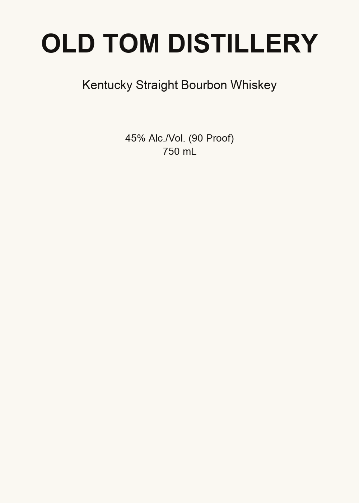

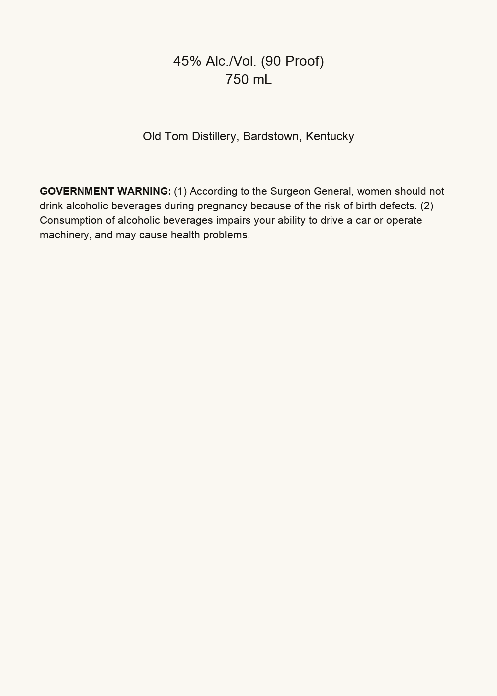

| Field | Application says | Expected |
|---|---|---|
| brand_name | OLD TOM DISTILLERY | clean |
| class_type | Kentucky Straight Bourbon Whiskey | clean |
| alcohol_content | 45.0 | clean |
| net_contents | 750 mL | clean |
| producer | Old Tom Distillery | clean |
| country_of_origin | — | clean |
| government_warning | *(the statute's text)* | clean |

---

### [ ] `tc17_table_wine` · wine

> TC-17. Table wine at or below 14% may omit alcohol content. Must be Not applicable, never a false Missing.

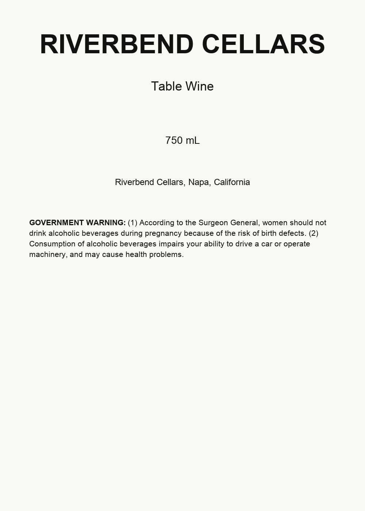

| Field | Application says | Expected |
|---|---|---|
| brand_name | RIVERBEND CELLARS | clean |
| class_type | Table Wine | clean |
| alcohol_content | — | **not_applicable** |
| net_contents | 750 mL | clean |
| producer | Riverbend Cellars | clean |
| country_of_origin | — | clean |
| government_warning | *(the statute's text)* | clean |

---

### [ ] `tc18_malt_no_abv` · malt

> TC-18. Alcohol content is federally optional on malt. Not applicable.

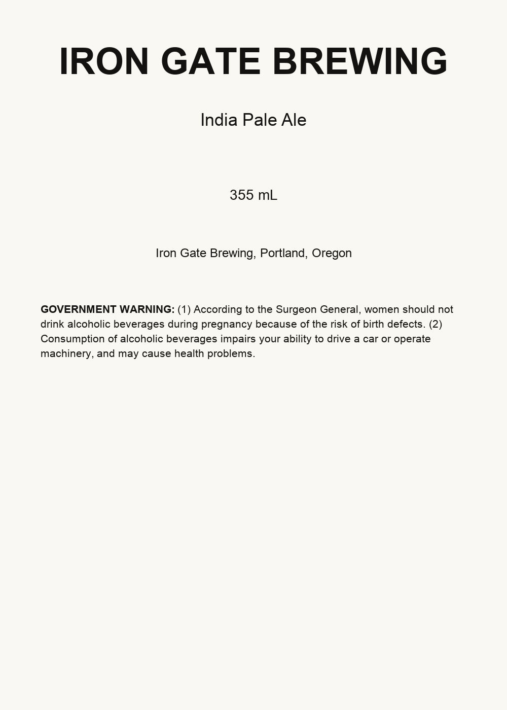

| Field | Application says | Expected |
|---|---|---|
| brand_name | IRON GATE BREWING | clean |
| class_type | India Pale Ale | clean |
| alcohol_content | — | **not_applicable** |
| net_contents | 355 mL | clean |
| producer | Iron Gate Brewing | clean |
| country_of_origin | — | clean |
| government_warning | *(the statute's text)* | clean |

---

### [ ] `tc19_import_missing_origin` · spirits

> TC-19. Application marks this an import; the label carries no country of origin. Paired with an application where is_import is true.

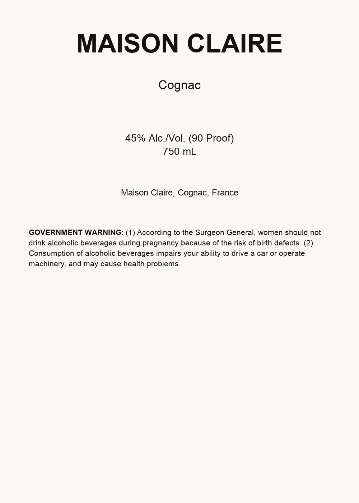

| Field | Application says | Expected |
|---|---|---|
| brand_name | MAISON CLAIRE | clean |
| class_type | Cognac | clean |
| alcohol_content | 45.0 | clean |
| net_contents | 750 mL | clean |
| producer | Maison Claire | clean |
| country_of_origin | France | **missing** |
| government_warning | *(the statute's text)* | clean |

---

### [ ] `tc22_spirits_abv_abbreviation` · spirits

> TC-22. Value is correct so the verdict is Match; using 'ABV' on a spirits label is a format finding riding alongside.

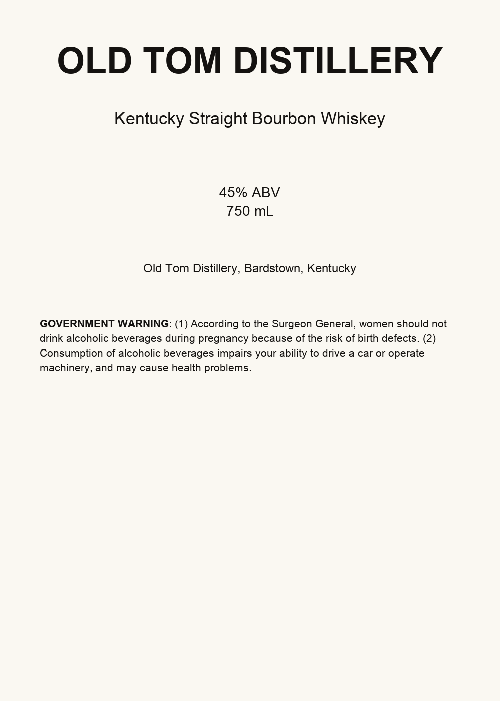

| Field | Application says | Expected |
|---|---|---|
| brand_name | OLD TOM DISTILLERY | clean |
| class_type | Kentucky Straight Bourbon Whiskey | clean |
| alcohol_content | 45.0 | **match** |
| net_contents | 750 mL | clean |
| producer | Old Tom Distillery | clean |
| country_of_origin | — | clean |
| government_warning | *(the statute's text)* | clean |

Must also raise: `spirits_abv_abbreviation`

---

### [ ] `tc23_all_caps_warning` · spirits

> Found on a shipping Fireball bottle. The whole statement set in capitals is a printing convention, not a defect: 27 CFR 16.22(a)(2) governs the case of the HEADING and says nothing about the statement after it. Comparing case-sensitively returned this label for correction, which is the failure that stops an agent trusting the tool.

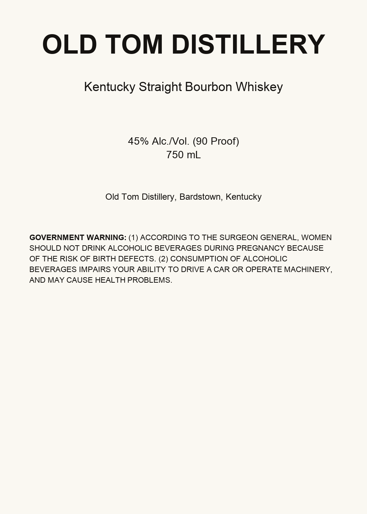

| Field | Application says | Expected |
|---|---|---|
| brand_name | OLD TOM DISTILLERY | clean |
| class_type | Kentucky Straight Bourbon Whiskey | clean |
| alcohol_content | 45.0 | clean |
| net_contents | 750 mL | clean |
| producer | Old Tom Distillery | clean |
| country_of_origin | — | clean |
| government_warning | *(the statute's text)* | **match** |

---

### [ ] `tc24_producer_with_lead_in_phrase` · spirits

> Found on a Found North bottle. Labels print the producer inside a phrase — 'BOTTLED BY', 'PRODUCED AND BOTTLED BY' — while the application holds the bare name. Called a Mismatch before `contains_after_normalization` existed. Acceptable variation rather than Match: the difference is real and named.

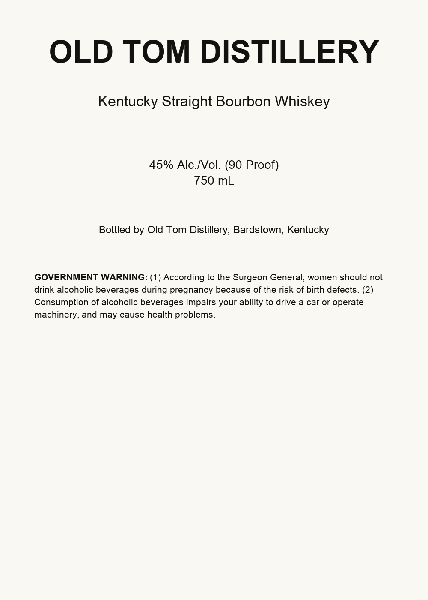

| Field | Application says | Expected |
|---|---|---|
| brand_name | OLD TOM DISTILLERY | clean |
| class_type | Kentucky Straight Bourbon Whiskey | clean |
| alcohol_content | 45.0 | clean |
| net_contents | 750 mL | clean |
| producer | Old Tom Distillery | **acceptable_variation** |
| country_of_origin | — | clean |
| government_warning | *(the statute's text)* | clean |

---

### [ ] `tc25_country_stated_as_a_phrase` · spirits

> The same shape as tc24 on a different field, and the second half of the Found North defect. The positive counterpart to TC-19, which is the case where origin is genuinely absent.

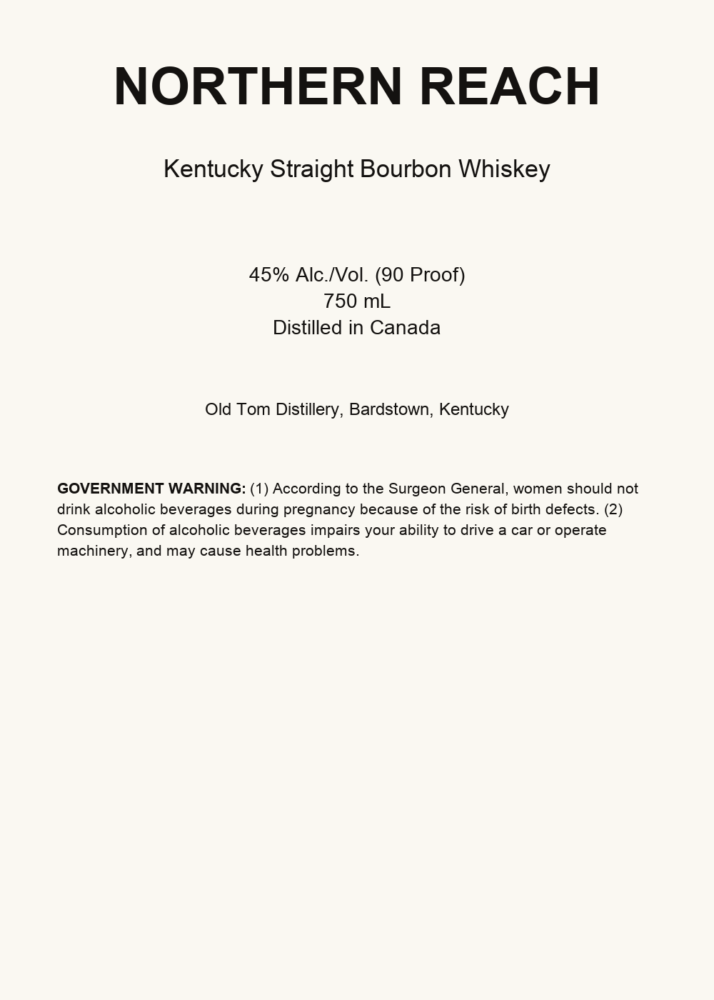

| Field | Application says | Expected |
|---|---|---|
| brand_name | NORTHERN REACH | clean |
| class_type | Kentucky Straight Bourbon Whiskey | clean |
| alcohol_content | 45.0 | clean |
| net_contents | 750 mL | clean |
| producer | Old Tom Distillery | clean |
| country_of_origin | Canada | **acceptable_variation** |
| government_warning | *(the statute's text)* | clean |

---

### [ ] `tc26_wine_above_fourteen_needs_abv` · wine

> The complement to TC-17. Below 14% a table wine may omit alcohol content; above it the statement is required, so an absent one is Missing rather than Not applicable. Without this fixture the exemption had no upper edge and a rule that always answered Not applicable would have scored perfectly.

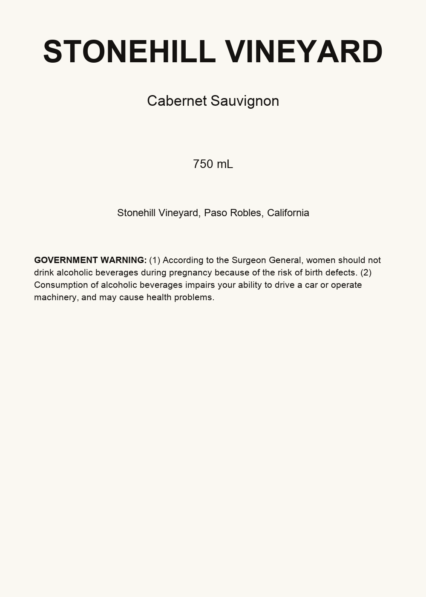

| Field | Application says | Expected |
|---|---|---|
| brand_name | STONEHILL VINEYARD | clean |
| class_type | Cabernet Sauvignon | clean |
| alcohol_content | 15.5 | **missing** |
| net_contents | 750 mL | clean |
| producer | Stonehill Vineyard | clean |
| country_of_origin | — | clean |
| government_warning | *(the statute's text)* | clean |

---

### [ ] `tc27_malt_in_fluid_ounces` · malt

> Every other fixture states net contents in millilitres. US malt beverages are labelled in fluid ounces, so the standards-of-fill path had never been exercised against the unit an agent actually sees most often.

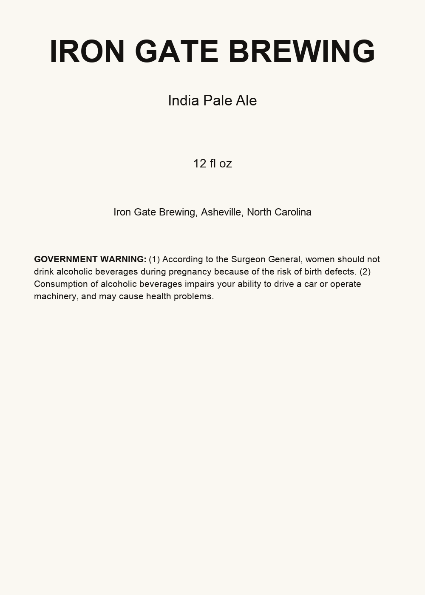

| Field | Application says | Expected |
|---|---|---|
| brand_name | IRON GATE BREWING | clean |
| class_type | India Pale Ale | clean |
| alcohol_content | — | **not_applicable** |
| net_contents | 12 fl oz | clean |
| producer | Iron Gate Brewing | clean |
| country_of_origin | — | clean |
| government_warning | *(the statute's text)* | clean |

---

### [ ] `tc28_brand_with_an_accent` · wine

> A Courtyard Winery photograph scored 'Dry Rosé' against 'Dry Rose' this way and it is the right answer, which is why the fixture expects it. The engine names the difference — 'differences in case, diacritics only; same text' — rather than folding it into a silent Match. An accent is usually a transcription artefact, but 'usually' is the agent's call to make, and a tool that quietly equates two spellings of a brand has decided it for them.

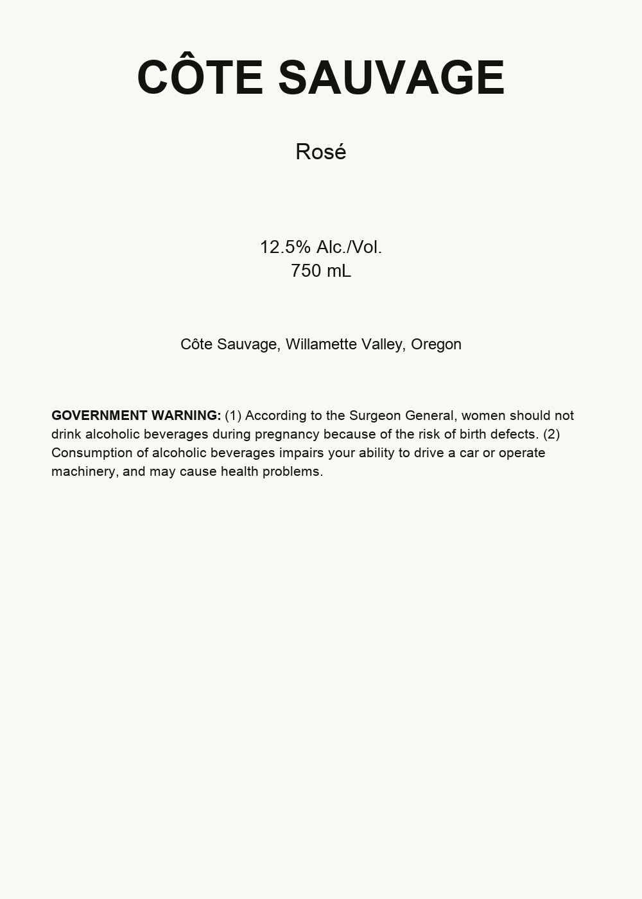

| Field | Application says | Expected |
|---|---|---|
| brand_name | Cote Sauvage | **acceptable_variation** |
| class_type | Rose | **acceptable_variation** |
| alcohol_content | 12.5 | clean |
| net_contents | 750 mL | clean |
| producer | Côte Sauvage | clean |
| country_of_origin | — | clean |
| government_warning | *(the statute's text)* | clean |

---
